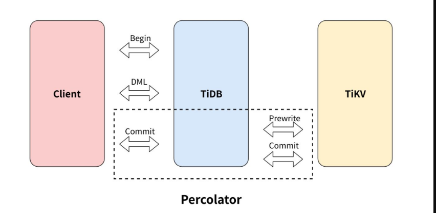
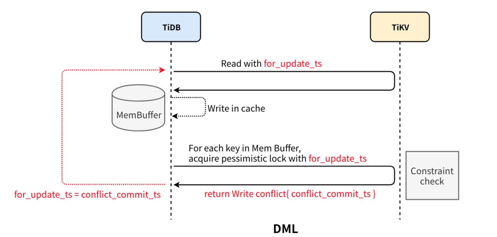
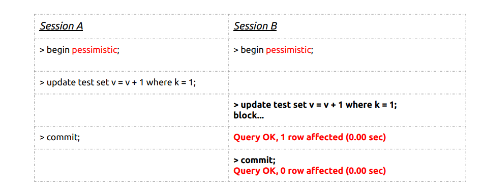
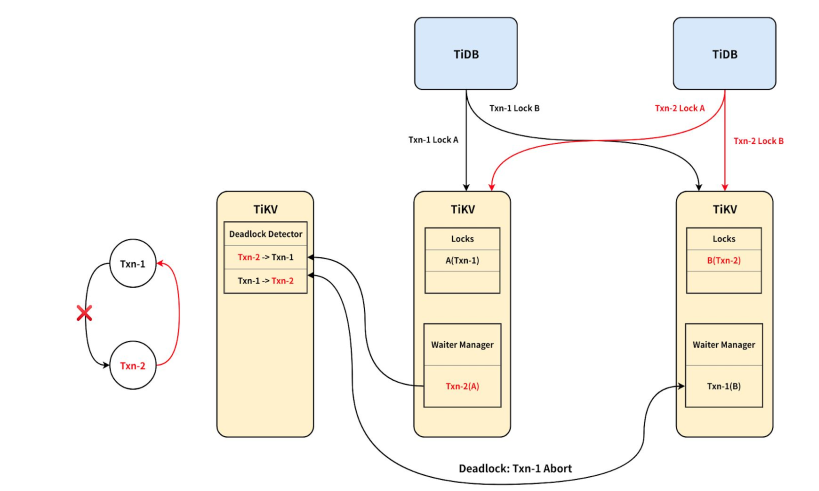
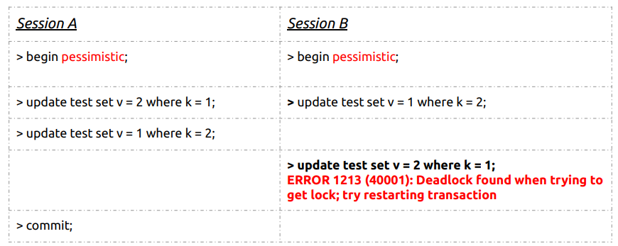

# 悲观事务

为了让 TiDB 的使用方式更加贴近传统单机数据库，更好的适配用户场景，在乐观事务模型的基础上，TiDB 实现了悲观事务模型。本文将介绍 TiDB 悲观事务模型特点。

# 悲观锁解决的问题

- 通过支持悲观事务，降低用户修改代码的难度甚至不用修改代码。

   在 v3.0.8 之前，TiDB 默认使用的乐观事务模式会导致事务提交时因为冲突而失败。

  为了保证事务的成功率，需要修改应用程序，加上重试的逻辑。

  

- 乐观事务模型在冲突严重的场景和重试代价大的场景无法满足用户需求，支持悲观事务可以
  弥补这方面的缺陷，拓展 TiDB 的应用场景 。

    举个简单的例子：

  发工资，对于一个用人单位来说，发工资的过程其实就是从企业账户给多个员工的个人账户转账的过程，

  一般来说都是批量操作，在一个大的转账事务中可能涉及到成千上万的更新，想象一下如果这个大事务执行的这段时间内，某个个人账户发生了消费（变更），

  如果这个大事务是乐观事务模型，提交的时候肯定要回滚，涉及上万个个人账户发生消费是大概率事件，如果不做任何处理，最坏的情况是这个大事务永远没办法执行，一直在重试和回滚（饥饿）

  

# TiDB事务模型回顾

TiDB 使用基于 Percolator 的​乐观事务模型​，支持快照隔离的事务​隔离级别​，

- Percolator 是 Google 在 OSDI 2010 的一篇 [论文](https://ai.google/research/pubs/pub36726) 中提出的在一个分布式 KV 系统上构建分布式事务的模型，其本质上还是一个标准的 2PC（2 Phase Commit），2PC 是一个经典的分布式事务的算法

- TiDB 实现了快照隔离 (Snapshot Isolation, SI) 级别

  SQL-92 标准定义了 4 种隔离级别,其中的可重复读。

  | 隔离级别(Isolation Level)    | 脏读（Dirty Read） | 不可重复读（NonRepeatable Read） | 幻读（Phantom Read） |
  | :--------------------------- | :----------------- | :------------------------------- | :------------------- |
  | 未提交读（Read uncommitted） | 可能               | 可能                             | 可能                 |
  | 已提交读（Read committed）   | 不可能             | 可能                             | 可能                 |
  | 可重复读（Repeatable read）  | 不可能             | 不可能                           | 可能                 |
  | 可串行化（Serializable ）    | 不可能             | 不可能                           | 不可能               |

# TiDB悲观事务模型

## 基于Percolator的悲观事务

TiDB 悲观事务在乐观事务基础上实现，其核心设计思想为，**在 Prewrite 之前增加了 Acquire**

Pessimistic Lock 阶段，其要点为：

● 执行 DML 时，对修改的 key 加上悲观锁 。

● 事务提交同 Percolator :

  ○ Prewrite 将悲观锁改写为 Percolator 的乐观锁，悲观锁的存在保证了 Prewrite 必定成功。
  ○ 遇到悲观锁时可以保证该锁的事务未到 Commit 阶段，从而不会阻塞读。  

● 基于 Percolator，实现分布式事务的原子提交、Snapshot Isolation，同时保证了与乐观事务的兼容性，支持混合使用。    

## 如何添加悲观锁

- 执行 DML 获取到需要修改的 key。

- 对要修改的 key 加上悲观锁

- Prewrite 时的约束检查提前到 Pessimistic Lock 阶段。 

- 遇到更新的数据  ，DML 执行要基于最新已提交的数据，需要重新 执行 DML  

​      除了 start ts 和 commit ts，增加了 for update ts 用于悲观事务读取最新已提交的数据  

## 分布式死锁检测

等锁就有可能发生死锁，TiDB 采用的是全局死锁检测来解决死锁：

- 在整个 TiKV 集群中，有一个死锁检测器 leader。

- 当要等锁时，其他节点会发送检测死锁的请求给 leader。  

## 支持 Read Consistency 隔离级别

由于历史原因，当前主流数据库的读已提交隔离级别本质上都是 Oracle 定义的一致性读隔离
级别。TiDB 为了适应类似用户场景需求，在悲观事务中实现了一致性读隔离级别，其语义和
Oracle 的一致性读隔离级别保持一致。

该模式仅在悲观事务模式下生效，用户在使用悲观事
务模型时，可以根据自身需要选择。

# 悲观事务的使用方法

进入悲观事务模式有以下三种方式:

* 执行 BEGIN PESSIMISTIC; 语句开启的事务，会进入悲观事务模式。 

  可以通过写成注释的形式 BEGIN /*!90000 PESSIMISTIC */; 来兼容 MySQL 语法。

* 执行 set @@tidb_txn_mode = 'pessimistic';，使这个 session 执行的所有显式事务（即非 autocommit 的事务）都会进入悲观事务模式。

* 执行 set @@global.tidb_txn_mode = 'pessimistic';，使之后整个集群所有新创建 session 执行的所有显示事务（即非 autocommit 的事务）都会进入悲观事务模式。

# MySQL 兼容性  

**悲观事务的行为和 MySQL 基本一致（不一致之处详见和 MySQL InnoDB 的差异）**

- 当一行数据被加了悲观锁以后，其他尝试修改这一行的写事务会被阻塞，等待悲观锁的释放

* SELECT FOR UPDATE 会读取已提交的最新数据，并对读取到的数据加悲观锁

  

* 死锁监测

  

* UPDATE、DELETE 和 INSERT 语句都会读取已提交的最新的数据来执行，并对修改的数据加悲观锁。

* 当一行数据被加了悲观锁以后，其他尝试读取这一行的事务不会被阻塞，可以读到已提交的数据

  

**由于只支持行锁模式，TiDB 在加锁行为和表现上和 MySQL 有一定的区别** .

