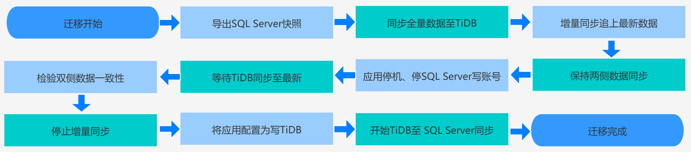

## 5.3 SQL Server 迁移到 TiDB

### 5.3.1 迁移背景

随着业务不断地增长，数据不断地递增，当线上场景的 SQL server 主库有十亿级数据，每天有千万级 DAU、亿级的访问量，接口日均调用量 1000000000+ 次，很可能会触达 SQL server 集群的一些瓶颈。以至于用户不得不寻找一个新的数据库产品替换现有的架构，那么可能会遇到一下的问题：

      1、数据采用分库分表的设计，来解决当 SQL Server 单表数据量过大，出现的性能下降等问题。假设目前业务场景有 100 多个库包含 1000 多张表，随着应用的不断发展，需求的不断变化，发现在实现某些业务场景中，需要关联很多张表才能满足需求。那么分库分表的结构就难以满足，所以需要数据逻辑最好能在一张表上实现。

      2、近些年来，随着业务加速成长，数据量突飞猛进。而硬盘容量是有限的，每台服务器上能扩展的硬盘数量也是有限的。一方面每隔一段时间都要增加更大容量的存储服务器来应对数据增长，每次更换服务器的时候需要关注 SQL Server 扩容规划。另外一方面大容量数据库服务器价格昂贵，同时需要做到扩容对应用无感知。

至此本节将介绍如何实现从 SQL Server 到 TiDB 的整体迁移流程，包括全量与增量同步，数据校验及注意事项等内容，希望本节可以帮助想要将 SQL Server 迁移到 TiDB 的用户提供上手操作指导。

### 5.3.2 流程介绍

下图为在线迁移数据库的基本流程，供读者对整体流程有个大致的认识：



执行过程中，可根据实际情况，结合如下表格制定迁移操作手册：

|迁移阶段|流程| 
|:----|:----|
| 全量同步 |1. 开启 SQL Server 从库的 CDC；<br> 2. 导出 SQL Server 快照到备份服务器；<br>3. 从备份服务器将存量数据 ETL 至 TiDB；<br>4. 检查两侧数据条数是否相同 | 
| 增量同步 |1. 读取CDC记录，持续写入 TiDB；<br>2. 检查增量数据一致性 | 
| 切换数据库 |1. 停止 SQL Server 写入；<br>2. 等待 CDC 消费完成，检查数据一致性；<br>3. 业务数据写入 TiDB| 

### 5.3.3 全量同步

#### 1. 迁移工具

迁移工具采用 yugong。yugong 是阿里开发的一款去Oracle数据迁移同步工具，[https://github.com/alswl/yugong](https://github.com/alswl/yugong) 版本基于阿里的版本增加了对SQL Server数据源的支持。

#### 2. 操作步骤

##### (1) 下载 yugong

```shell
# 方法一：直接下载可执行文件 jar 包
wget https://github.com/alswl/yugong/releases/download/541e5f8/yugong-shaded.jar

# 方法二：自行编译
git git@github.com:alswl/yugong.git
cd yugong
mvn clean package
```

##### (2) 修改配置

运行 yugong 需要用到两个配置文件 `yugong.properties` 和 `yugong.yaml`。

- `yugong.properties` 文件用于配置数据库链接和同步任务

```bash
# vi 编辑 yugong.properties
vi yugong.properties
```

```conf
# 源数据库配置
yugong.database.source.url=jdbc:sqlserver://192.168.1.88:1433;databaseName=example
yugong.database.source.username=sa
yugong.database.source.password=sa
yugong.database.source.type=SQL_SERVER
yugong.database.source.encode=UTF-8
yugong.database.source.poolSize=200

# 目标数据库配置，TiDB 使用 MySQL 协议
yugong.database.target.url=jdbc:mysql://192.168.1.99:3306/example?autoReconnect=true
yugong.database.target.username=root
yugong.database.target.password=root
yugong.database.target.type=MYSQL
yugong.database.target.encode=UTF-8
yugong.database.target.poolSize=200
yugong.table.batchApply=true
yugong.table.onceCrawNum=1000
yugong.table.tpsLimit=0
# 使用数据库链接中的 schema
yugong.table.ignoreSchema=false
# skip Applier Load Db failed data
yugong.table.skipApplierException=false
# 需要迁移的数据库表
yugong.table.white=user
yugong.table.black=
# 是否开启并发
yugong.table.concurrent.enable=true
# 并发数
yugong.table.concurrent.size=6
# retry times
yugong.table.retry.times=3
# retry interval or sleep time (ms)
yugong.table.retry.interval=1000
# MARK/FULL/INC/ALL(REC+FULL+INC)/CHECK/CLEAR
# 设置为FULL（全量模式）
yugong.table.mode=FULL


# yugong extractor
yugong.extractor.dump=false
yugong.extractor.concurrent.enable=true
yugong.extractor.concurrent.global=false
yugong.extractor.concurrent.size=60
yugong.extractor.noupdate.sleep=1000
yugong.extractor.noupdate.thresold=0
yugong.extractor.once=false

# yugong applier
yugong.applier.concurrent.enable=true
yugong.applier.concurrent.global=false
yugong.applier.concurrent.size=20
yugong.applier.dump=false
# stats
yugong.stat.print.interval=5
yugong.progress.print.interval=1
# alarm email
yugong.alarm.email.host=
yugong.alarm.email.username=
yugong.alarm.email.password=
yugong.alarm.email.stmp.port=
yugong.alarm.email.ssl.support=
```

- `yugong.yaml` 文件用于定制 translator 的定制，直接使用范例中的配置即可

```shell
# 下载 yugong.yaml.sample 模版文件
wget https://raw.githubusercontent.com/alswl/yugong/feature/sql-server-to-mysql-overview/yugong.yaml.sample

# 重命名为 yugong.yaml
mv yugong.yaml.sample yugong.yaml
```

##### (3) 运行 yugong

- 执行 yugong 的运行命令

```shell
# -c yugong.properties 数据库和任务配置文件
# -y yugong.yaml ETL 中 translator 流程的配置
# 执行命令
java -jar yugong-shaded.jar -c yugong.properties -y yugong.yaml
```

- 程序运行后，控制台会输出运行日志。

```log
# 程序启动
2019-12-02 20:49:23.923 [main] INFO  com.taobao.yugong.YugongApp - ## start the YuGong.
# 检查源数据库和目标数据库连接情况
2019-12-02 20:49:24.000 [main] INFO  
com.taobao.yugong.controller.YuGongController - check source database connection ...
2019-12-02 20:49:24.017 [main] INFO  com.taobao.yugong.controller.YuGongController - check source database is ok
2019-12-02 20:49:24.017 [main] INFO  com.taobao.yugong.controller.YuGongController - check target database connection ...
2019-12-02 20:49:24.028 [main] INFO  com.taobao.yugong.controller.YuGongController - check target database is ok
2019-12-02 20:49:24.028 [main] INFO  com.taobao.yugong.controller.YuGongController - check source tables read privileges ...
# 初始化连接池
2019-12-02 20:49:24.071 [main] INFO  com.alibaba.druid.pool.DruidDataSource - {dataSource-1} inited
2019-12-02 20:49:24.277 [main] INFO  com.alibaba.druid.pool.DruidDataSource - {dataSource-2} inited
2019-12-02 20:49:25.418 [main] INFO  com.taobao.yugong.controller.YuGongController - check source tables is ok.
# 启动同步任务线程
2019-12-02 20:49:26.933 [main] INFO  com.taobao.yugong.controller.YuGongController - ## prepare start tables[1] with concurrent[6]
2019-12-02 20:49:26.959 [main] INFO  com.taobao.yugong.YugongApp - ## the YuGong is running now ......
# 同步进度打印
2019-12-02 20:51:08.801 [Thread-7] INFO  com.taobao.yugong.common.stats.ProgressTracer - {未启动:0,全量中:0,已完成:1,异常数:0}
# 完成的任务
2019-12-02 20:51:08.801 [Thread-7] INFO  com.taobao.yugong.common.stats.ProgressTracer - 已完成:[example.user]
2019-12-02 20:51:08.805 [Thread-7] INFO  com.alibaba.druid.pool.DruidDataSource - {dataSource-2} closed
2019-12-02 20:51:08.806 [Thread-7] INFO  com.alibaba.druid.pool.DruidDataSource - {dataSource-1} closed
2019-12-02 20:51:08.807 [Thread-7] INFO  com.taobao.yugong.YugongApp - ## YuGong is down.
```

> **注意**
> 
> 通过以上日志可以判定任务是否成功启动和结束，如运行当中出现错误会有详细的堆栈信息打印出来，可进一步检查日志来判定问题。

##### (4) 检查日志

- 日志记录在 logs 目录下，结构如下：

```shell
logs
├── example.user  # 表名为目录
│   ├── applier.log  # 写入日志
│   ├── extractor.log  # 抽取数据日志
│   └── table.log  # 表操作日志
└── yugong
    └── table.log  # 系统日志
positioner_data
└── example_user.dat # 同步进度，用于断点续传
```

> **注意**
>
>主要观察 table.log 中的运行日志，查看是否有 `ERROR` 如重新同步数据，需删除相关表的日志和同步进度文件。

### 5.3.4 增量同步

#### 1. 增量同步的原理

增量同步需要开启 SQL Server 的 CDC。什么是 SQL Server CDC？ CDC 全称 Change Data Capture，设计目的就是用来解决增量数据。CDC 持续读取增量记录，将增量数据发送至消息队列中，以供消费程序解析并写入 TiDB。当数据库表发生变化，Capture process 会从 transaction log 里面获取数据变化， 然后将这些数据记录到 Change Table 里面。 可以通过特定的 CDC 查询函数将这些变化数据查出来。

#### 2. 实操流程

##### (1) 开启 SQL Server CDC

```sql
-- 开启CDC
sys.sp_cdc_enable_db;

-- 开启 example 表的CDC功能
EXEC sys.sp_cdc_enable_table @source_schema = N'dbo', @source_name = N'example', @role_name = NULL;

-- 使用 SQL 查看哪些表开启了 CDC 功能。
-- 通过系统表查询开启CDC的表
SELECT name, is_cdc_enabled from sys.databases where is_cdc_enabled = 1;
```

##### (2) CDC 开启后，系统会生成一张 `Change Table` 的表，表名为： `cdc.dbo_example_CT`

```sql
.schema cdc.dbo_example_CT
name            default  nullable  type          length  indexed
--------------  -------  --------  ------------  ------  -------
__$end_lsn      null     YES       binary        10      NO
__$operation    null     NO        int           4       NO
__$seqval       null     NO        binary        10      NO
__$start_lsn    null     NO        binary        10      YES
__$update_mask  null     YES       varbinary     128     NO
id              null     YES       int           4       NO
name            null     YES       varchar(255)  255     NO
```

> **注意**
>
>其中 _ _ 开头的为系统字段，id 和 name 为 example 表中原始字段。

##### (3) 读取 CDC 日志

- 对 example 表做一些添删改的操作，而后通过系统函数查询 CDC 记录。

```sql
-- 定义参数
DECLARE @begin_time datetime, @end_time datetime, @begin_lsn binary(10), @end_lsn binary(10);

-- 设定查询记录的开始和结束时间
SET @begin_time = '2020-03-08 10:00:00.000';
SET @end_time   = '2020-03-08 10:10:00.000';

-- 将时间转换为系统的 lsn
SELECT @begin_lsn = sys.fn_cdc_map_time_to_lsn('smallest greater than', @begin_time);
SELECT @end_lsn = sys.fn_cdc_map_time_to_lsn('largest less than or equal', @end_time);

-- 根据开始和结束的 lsn 查询该表的所有变化
SELECT * FROM cdc.fn_cdc_get_all_changes_dbo_example(@begin_lsn, @end_lsn, 'all');
```

- 查出数据如下：

```sql
__$start_lsn          __$end_lsn  __$seqval             __$operation  __$update_mask  id  name
--------------------  ----------  --------------------  ------------  --------------  --  ------
0000dede0000019f001a  null        0000dede0000019f0018  2             03              1   AAA
0000dede000001ad0004  null        0000dede000001ad0003  2             03              2   BBB
0000dede000001ba0003  null        0000dede000001ba0002  3             02              2   BBB
0000dede000001ba0003  null        0000dede000001ba0002  4             02              2   CCC
0000dede000001c10003  null        0000dede000001c10002  2             03              3   DDD
0000dede000001cc0005  null        0000dede000001cc0002  1             03              3   DDD
```

> **注意**
> 
>__$operation 字段代表当前记录所执行的操作。
>* 删除
>* 插入
>* 更新前
>* 更新后

##### (4) 消费 CDC 日志

确认 CDC 正确开启，且得到了变更数据后，编写一个程序，采用定时任务的方式，设定时间间隔，通过上述 SQL 语句持续读取 Change Table 中的记录，并根据 `__$operation` 将数据转换为对应添删改操作的 SQL 语句写入 TiDB。

> 这里有几点需要考量：
>
>  1. 数据规模，如果变更量较大，那么下游数据库的写入速度会产生瓶颈，则考虑使用 `Kafka`、`RabbitMQ` 等消息队列作为缓冲。
>
>  2. 使用 `Kafka` 等消息队列时，考虑消息顺序的严格性，将 `Topic` 的  `Partition` 设置为 `1` 。
>
>  3. 下游数据库更新异常时的重试机制。
>
>  4. 因为全量同步之前 CDC 已经开启，所以增量同步时，可能会存在插入数据时出现主键冲突导致程序异常，推荐使用 `insert ignore` 的方式编写 SQL。

### 5.3.5 检查数据一致性

在 ETL 之后，需要有一个流程来确认数据迁移前后是否一致。 虽然理论上不会有差异，但是如果中间有程序异常，或者数据库在迁移过程中发生操作，数据就会不一致。

选择 yugong 作为 ETL 工具的一大原因也是因为它提供了多种模式。支持 `CHECK`、`FULL`、`INC`、`AUTO` 四种模式。 其中 `CHECK` 模式就是将 yugong 作为数据一致性检查工具使用。 yugong 工作原理是通过 `JDBC` 根据主键范围变化，将数据取出进行批量对比。

有一点需要注意，当表没有主键信息时，yugong 默认会使用 SQL Server 的物理地址信息—— `physloc` 。 此时读取性能会大幅下降，所以大表通常建议先建好主键。

在增量同步时，还有另一个方式来实现数据校验功能，再增加一个消费程序，延迟 5 秒消费同一队列，并通过提取主键（或索引）的方式从 TiDB 中查出该条已经写入的数据，将两侧的整行数据做比较（本实践中去除主键后比较），如果有问题会进行尝试重新写入，如出现异常则向相关人员发送报警。

### 5.3.6 迁移注意事项

在迁移过程中需要注意的一些点：

1. 原有 SQL server 语句一定要在程序里检查仔细，尤其是对于一些时间久远且项目比较多的程序，最好是让 DBA 同学在 SQL server 服务请求上开启 DMV，多抓几天的语句，然后根据这些语句再去核对。

2. SQL Server 与 TiDB（MySQL）的字段类型略有出入，需要仔细对比。

3. SQL Server 与 TiDB（MySQL）的语法也不尽相同，在实现之后需要仔细验证，以防出现语义变化，影响业务。

4. 索引机制不同，可以利用迁移的机会重新梳理业务索引。

5. 对于大型系统迁移，演练不可缺少。演练成功标准为单次演练无意外，时间控制在计划内。

6. 通常为了保证数据的顺序性，增量同步时只能有一个程序在消费。所以要多考虑程序健壮性、日志的完善程度以及报警机制，方便技术人员监控和追溯问题。

### 5.3.7 总结

这套迁移流程，综合考虑了开发成本、迁移效率和数据一致性而设计。TiDB 兼容 MySQL 的特性，使得在迁移过程中有许多“轮子”可以拿起来就用，让开发人员可以将更多关注放在数据本身。在下一章节中我们还会介绍另外一种 SQL Server 迁移到 TiDB 的方案，相信大家会有新的思考和体会。