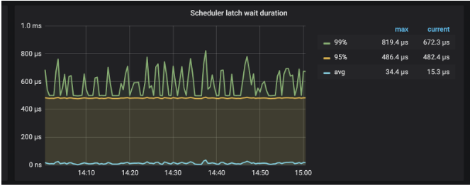
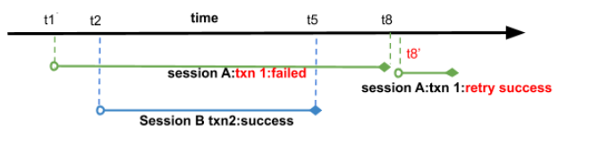

## 6.1.1 乐观锁模式下的事务最佳实践
在 3.0.8 之前，TiDB 的默认事务模式是乐观事务， TiDB 乐观事务存在以下优点：

* 基于单实例事务实现了跨节点事务
* 去中心化的锁管理

缺点如下：

* 两阶段提交，网络交互多。
* 需要一个中心化的版本管理服务。
* 事务在 commit 之前，数据写在内存里，数据过大内存就会暴涨

基于以上缺点，我们有了后面的建议。

### 6.1.1.1 减少乐观锁事务冲突
事务的冲突，主要分两种：

* 读写冲突：存在并发的事务，部分事务对相同的 Key 读，部分事务对相同的 Key 进行写。
* 写写冲突：存在并发的事务，同时对相同的 Key 进行写入。

在 TiDB 的乐观锁机制中，因为是在客户端对事务 commit 时，才会触发两阶段提交，检测是否存在写写冲突。所以，在乐观锁中，存在写写冲突时，很容易在事务提交时暴露，因而更容易被用户感知。

频繁乐观锁事务冲突会对应用的整体性能造成很大影响

1. 当前应用和 TiDB 需要额外的时间和资源重试失败的事务
2. 微服务环境下，应用本身常是上下游服务间柔性事务（如TCC) 的一部分。这时失败的 TiDB事务会触发应用层的回滚和重试，从而对整个服务链路带来压力


业务上并发修改的场景(如账本, 余额, 秒杀等), 需要改造业务, 减少乐观锁事务冲突, 常见方案有

1. 业务要求同步执行时, 使用 TiDB v3 引入的悲观锁, 或者分布式锁(如 redis ), 将业务串行化
2. 业务允许异步执行时，使用消息队列串行化请求, 消息队列之前可以用缓存限流. 当使用消息队列写入 TiDB 时， 将同一行的读写分配到同一个分区 (例如 kafka 的 partition),这样不同消费者之间就不会对同一行并发读写
3. 将大事务拆解成多个小事务以减少单个事务的运行时间。需要注意的是如果事务粒度过细，事务网络开销也会造成性能问题，需要根据业务场景压测的结果得到最优的事务大小

### 6.1.1.2 控制事务大小
TiDB 两阶段提交的网络开销相对较大，因此建议将多个单行事务(100～500 行)打包成一个多行事务发送

当事务过大时，会有以下问题

1. TiDB 内存使用量过大甚至OOM
1. 乐观锁事务冲突可能性变大。 对大事务的不断重试更是性能上的恶性循环
1. 第二阶段提交时耗时过长

因此目前 TiDB 对大事务有如下限制

1. 单个事务包含的 SQL 语句不超过 5000 条（默认）
2. 每个键值对不超过 6MB
3. 键值对的总数不超过 300,000
4. 键值对的总大小不超过 100MB

### 6.1.1.3 冲突预检
检测数据是否存在写写冲突是一个很重的操作，这个操作在 prewrite 时 TiKV 中具体执行。为了优化这一块性能，TiDB 集群会在内存里面进行一次冲突预检测。

主要在两个模块进行：

* TiDB 层，如果在 TiDB 实例本身发现存在写写冲突，那么第一个写入发出去后，后面的写入就已经能清楚的知道自己冲突了，没必要再往下层 TiKV 发送请求去检测冲突。
* TiKV 层，主要发生在 prewrite 阶段。因为 TiDB 集群是一个分布式系统，TiDB 实例本身无状态，实例之间无法感知到彼此的存在，所以无法确认自己的写入与 别的 TiDB 实例是否存在冲突，所以会在 TiKV 这一层检测具体的数据是否有冲突。

其中 TiDB 层的冲突检测通过下面参数控制：

``` 
txn-local-latches  事务内存锁相关配置，当本地事务冲突比较多时建议开启。  enable  开启  默认值：false  
capacity  Hash 对应的 slot 数，会自动向上调整为 2 的指数倍。每个 slot 占 32 Bytes 内存。当写入数据的范围比较广时（如导数据），设置过小会导致变慢，性能下降。  默认值：1024000  
``` 

这里 capacity 的配置会影响到冲突判断的正确性。在实现冲突检测时，真正存下来的是每个 key 的 hash 值，有 hash 算法就有误判的概率，这里我们通过 capacity 来控制 hash 取模的值：

* capacity 值越小，占用内存小，误判概率越大。
* capacity 值越大，占用内存大，误判概率越小。

如果业务场景能够预判断写入不存在冲突，建议关闭 TiDB 层的冲突检测。

TiKV 内存中的冲突检测也有一套类似的机制。不同的是，TiKV 的检测是必须进行的，只提供了一个 hash 取模值的配置项：

``` 
scheduler-concurrency  scheduler 内置一个内存锁机制，防止同时对一个 key 进行操作。每个 key hash 到不同的槽。  默认值：2048000   
```

此外，TiKV 提供了监控查看具体消耗在 latch 等待的时间：



如果发现这个 wait duration 特别高，说明耗在等待锁的请求上比较久，如果不存在底层写入慢问题的话，基本上可以判断这段时间内冲突比较多。

### 6.1.1.4 谨慎使用tidb的乐观锁重试机制
由于乐观锁是在 commit 阶段检测事务冲突，在冲突比较大的时候，Commit 很容易出现失败，而悲观锁模式数据库如 MySQL 的冲突检测在 SQL 执行过程中执行，所以 commit 时很难出现异常。为了解决这种行为不一致的问题， TiDB 提供了重试机制，由以下两个参数控制：

* [tidb_disable_txn_auto_retry](https://pingcap.com/docs-cn/v3.0/reference/configuration/tidb-server/tidb-specific-variables/#tidb_disable_txn_auto_retry)：这个参数控制是否自动重试，默认为 on，即不重试。
* [tidb_retry_limit](https://pingcap.com/docs-cn/v3.0/reference/configuration/tidb-server/tidb-specific-variables/#tidb_retry_limit)：用来控制重试次数，注意只有第一个参数启用时该参数才会生效

重试的步骤如下：

1. 重新获取 start_ts
2. 对带写入的 SQL 进行重放
3. 两阶段提交

打开乐观锁重试时（tidb_disable_txn_auto_retry = off），如果事务写入的执行条件依赖于这个事务中先前读到的结果，并发执行就会有 lost update 问题。此时不要打开 TiDB 乐观锁的重试机制。需要注意的是，如果是一些内部原因引起的重试不需要新的 tso, 例如网络抖动，平衡 region 等原因引起的重试，TiDB 会自动的，安全的重试，即使tidb_disable_txn_auto_retry = off

打开了重试后，我们来看下面的例子：

| 时间   | Session A   | Session B   | 
| :-- | :------ | :------ |
| t1   | MySQL [test]> begin; <br>***Query OK, 0 rows affected (0.00 sec)*** |    | 
| t2   |    | MySQL [test]> begin;<br>  ***Query OK, 0 rows affected (0.00 sec)*** | 
| t3   |    | MySQL [test]> update tidb set status=0 where id=1;  <br>***Query OK, 1 row affected (0.01 sec)*** <br> ***Rows matched: 1  Changed: 1  Warnings: 0*** | 
| t4   | MySQL [test]> select * from tidb where id=1; <br> ***+------+------+--------+***  <br>***\| id   \| name \| status \|*** <br> ***+------+------+--------+*** <br> ***\| &#160;1&#160; &#160;\| tikv &#160;&#160;&#160;&#160;\| 1 &#160;&#160;&#160;&#160;&#160;&#160;&#160;\|*** <br> ***+------+------+--------+***<br>  ***1 row in set (0.01 sec)*** |    | 
| t5   |    | commit;<br>  ***Query OK, 0 rows affected (0.01 sec)*** | 
| t6   | update tidb set name='pd' where id =1 and status=1;  <br>**Query OK, 1 row affected (0.00 sec)** <br> **Rows matched: 1  Changed: 1  Warnings: 0** |    | 
| t7   | MySQL [test]> select * from tidb where id=1; <br> ***+------+------+--------+*** <br> ***\| id   \| name \| status \|*** <br> ***+------+------+--------+***  <br> ***\| 1 &#160;&#160;&#160;\| pd   &#160;&#160;&#160;&#160;\|1&#160;&#160;&#160;&#160;&#160;&#160;&#160;&#160;&#160; \|*** <br> ***+------+------+--------+***  <br>***1 row in set (0.01 sec)*** |    | 
| t8   | MySQL [test]> commit; <br> ***Query OK, 0 rows affected (0.01 sec)*** |    | 
| t9   | MySQL [test]> select * from tidb where id=1; <br> ***+------+------+--------+*** <br> ***\| id   \| name \| status \|***<br> ***+------+------+--------+*** <br> ***\|    1 &#160;&#160;&#160;\| tikv &#160;&#160;&#160;&#160;\| 0 &#160;&#160;&#160;&#160;&#160;&#160;&#160;&#160;\|*** <br> ***+------+------+--------+***  <br>***1 row in set (0.00 sec)*** |    |  

我们来详细分析以下这个 case:



* 如图，在session B 在 t2 开始事务 2，t5 提交成功。session A 的事务 1 在事务 2 之前开始，在事务2 提交完成后提交。
* 事务 1、事务 2 会同时去更新同一行数据。
* session A 提交事务 1 时，发现冲突，tidb 内部重试事务 1
  * 重试时，重新取得新的 start_ts 为 t8’
  * 回放更新语句 update tidb set name='pd' where id =1 and status=1
    * 发现当前版本 t8’ 下并不存在符合条件的语句，不需要更新
    * 没有数据更新，返回上层成功
* tidb 认为事务 1 重试成功，返回客户端成功。
* session A 认为事务执行成功，查询结果，在不存在其他更新的情况下，发现数据与预想的不一致。

这里我们可以看到，对于重试事务，如果本身事务中更新语句需要依赖查询结果时，因为重试时会重新取版本号作为 start_ts，因而无法保证事务原本的 ReadRepeatable 隔离型，结果与预测可能出现不一致。

综上所述，如果存在依赖查询结果来更新 SQL 语句的事务，建议不要打开TiDB 乐观锁的重试机制。

在 TiDB 乐观事务模型下有一些缺点，需要应用，架构层进行改造。同时为了克服这些缺点，满足更加严苛的场景，TiDB 实现了悲观事务，可以参考悲观事务章节。


# 
