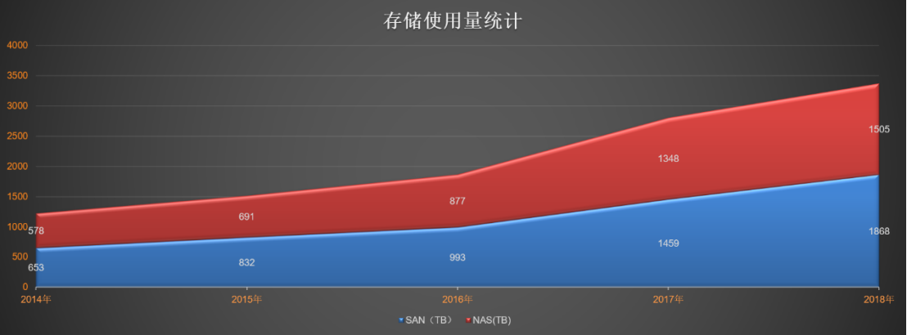
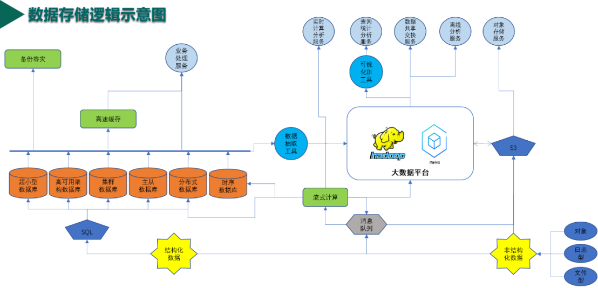
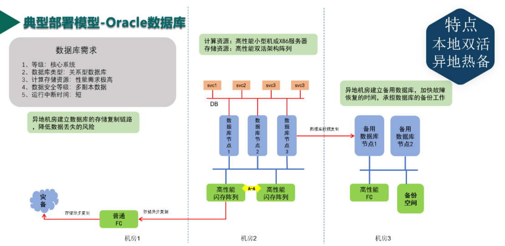
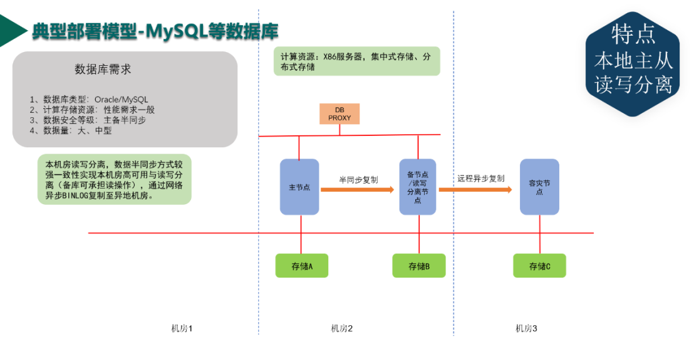
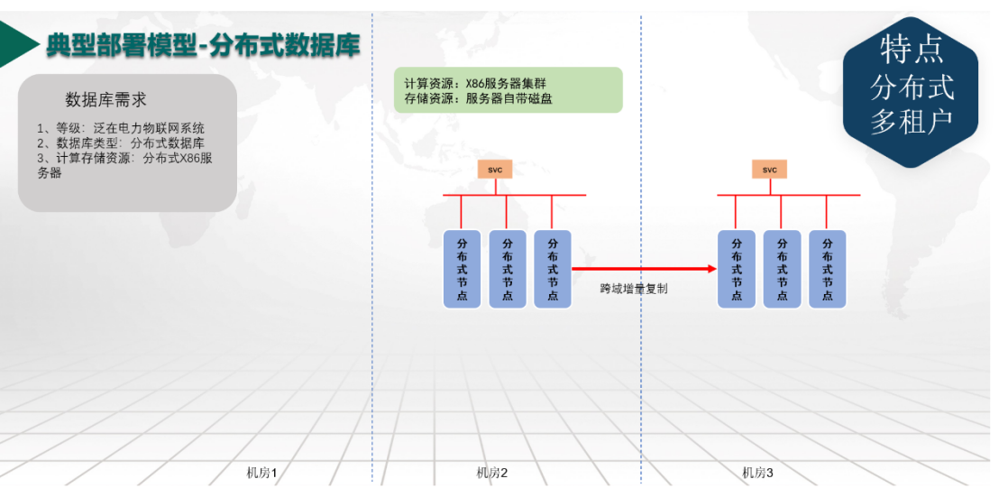

# 6.5 TiDB在企业数据分级存储种的应用

## 6.5.1 数据爆炸增长
随着建设信息化企业工作的深入，企业数据的增长呈现爆炸性的趋势。以某个省电力公司为例，在最近几年里的用于数据存储的设备上线也呈加速增长的态势。

2014 年该企业的 SAN 存储容量与 NAS 存储容量加载一起刚刚突破 1PB，到 2018 年，就已经翻了 3 倍了。从 2017 年开始，出现了更为高速增长的趋势。这些企业数据包括企业管理业务中产生的数据，面向设备采集的数据，也包括企业从外部购买的数据。这些数据大多数都存储在各种数据库系统种。在某省电力公司的已经建设了 180 多套数据库系统，用于存储各种各样的数据，而为了进一步支撑业务的开展，还需要再建设 100 多套数据库系统。这些用传统方式烟囱式建设的数据库系统带来的管理难度已经让运维部门叫苦不迭。

另外一个方面，由于各种数据与应用系统的的建设缺乏统一规划，这 180 多套数据库系统包括了 Oracle、DB2、MySQL、GBASE 8a、Mongodb、达梦、HIVE、HBASE等，再按数据库的版本统计，已经高达 20 多种。纷乱复杂的数据库种类，不同数据库版本之间的运维与建设差异，更是让运检部门深感头疼。

## 6.5.2 规划统一数据存储的顶层方案
为了在一个新的建设高峰到来之前先厘清现状，做好顶层设计，企业决定进行数据分层存储的顶层设计。首先把家底梳理清楚，然后进行整理分析，确定数据分类分级的标准，然后针对不同类级的数据制定统一的数据存储规范，采用统一的数据存储架构，减少数据库的种类，统一数据库的版本。

经过对企业数据的现状进行梳理，我们发现目前的企业数据存储逻辑架构式这样的：

其中结构化数据主要存储在关系型数据库中，而非结构化数据主要存储在大数据平台和对象存储中。非结构化数据的存储与处理起步较晚，因此规划基本合理，平台也比较统一。最大的问题是结构化数据，不同的业务需求与建设要求并没有在一个统一的顶层框架中考虑，因此不同规模，不同种类的数据库系统在不同的阶段被建设起来。很多数据库系统高峰期的并发访问量不超过 5 个，造成了绝大的资源浪费。另外一个极端是，有些数据库系统虽然已经使用了最为豪华的硬件配置，其处理能力已经严重不足，而企业很快将面临硬件扩无可扩的窘境。

为了解决目前企业的困境，同时为今后几年泛在电力物联网建设所面临的几十 PB 的设备数据接入做好准备，企业决定颠覆原有的数据存储架构，按照数据分级存储的总体远哲，规划统一数据存储的顶层方案。

新的顶层设计从两个方面进行考虑：
* 首先根据系统的特点不同，支持多种分级承载的方案，通过存储分层，为应用提供全面的支撑。
* 其次规范数据库的种类与版本，建立数据库标准化编排能力，逐步实现数据库部署自动化，最终实现全栈自动化编排。 

对于传统业务应用系统，数据分为在线数据、历史数据、归档数据等，根据访问特性不同采用不同档次的存储模式，存储方式主要以传统大型数据库系统为主；
* 对于泛在电力物联网应用，数据分为实时在线数据、热在线数据、温在线数据、本地历史数据、分布式历史数据等，不同的数据采用不同存储形式，数据以分布式方式存储，部分明细数据存储于边缘侧，数据主要存储于分布式关系型数据库。
* 对于互联网特征应用，学习互联网企业的经验，在线数据存储在内存缓冲层，热数据存储于高性能存储设备，冷数据存储于海量分布式存储，数据库采用分布式关系型数据库和分布式内存数据库。

## 6.5.3 关系型数据库规划
在经过重新规划梳理的数据存储架构中，关系型数据库仍然占据较为重要的位置，不过数据库的种类经过整理后将会缩小为 Oracle、MySQL、某种分布式关系型数据库三种。Oracle 数据库仍然承载传统的核心管理类应用系统，MySQL 数据库目前已经在企业内大规模使用，主要是在云上的小型数据库，分布式关系型数据库的选型是下一步选型的要点。在分布式关系型数据库选型时，根据企业数据分级存储顶层设计的要求，需要备选数据库满足以下的要求：

(1)	支持 ACID 事务：对于关系型数据库来说 ACID 是基本特性，但是在支持高并发的分布式场景中，在提升扩展性与系统性能的同时保证数据完整性与正确性成为了评估一款分布式数据库系统的重要指标之一。

(2)	水平弹性扩展：集中式数据库的架构使得数据库成为了整个系统的瓶颈，已经逐渐无法满足海量数据对存储和计算能力的巨大需求。企业选择的分布式数据库系统不仅仅你要求能够做横向的水平弹性扩展，而且需要扩展时对现有生产业务的影响最小化。

(3)	高可用性：首先，分布式数据库系统故障的恢复成本要远远高于普通的数据库系统，因此分布式数据库系统必须支持多副本自动容错；其次，为了进一步提高核心数据的可靠性，对于分布式数据库中的部分高可靠性要求的数据，还需要建立跨机房远程灾备，因此备选的分布式数据库系统必须支持远程增量复制，并且可以选择性复制部分数据。

(4) 为 OLTP 和 OLAP 场景提供一站式的解决方案：随着泛在电力物联网业务的发展，大量的数据需要多次使用，这些数据的量级是PB级的，因此通过搬数据的方式建立 OLTP 与 OLAP 两套数据库来满足不同的计算要求的成本太高，分布式关系型数据库必须支持 OLTP/OLAP 混合计算。

(5)	为了减少应用迁移的工作量与今后运维的工作量，备选的分布式数据库系统最好能与MySQL具有较好的兼容性。

经过对国内外的数十种数据库的比对分析，最终 TiDB 脱颖而出，作为分布式关系型数据库的首选。主要用于作为泛在电力物联网的核心支撑数据库系统。其应用模式分为三种模式：

(1)泛在电力物联网数据采集大型分布式数据库系统：建立大规模的数据库集群，用于海量物联网数据的采集、存储、共享、分析的核心数据库系统；

(2) 多租户数据库云服务：建立统一的数据库云服务，为企业各种小型数据库应用提供统一的服务；

(3) 边缘测数据中心的主数据库：在泛在电力物联网建设过程中，各类变电站、配电房中将会建设大量的小型数据中心，这些小型数据中心用于承担边缘侧数据的存储与计算任务，其数据库要求支撑海量计算、高可用、易扩展、易维护。

  在数据分级存储顶层设计原则指导下优化后的关系型应用系统，其部署架构被统一成三种模式。

对于传统的核心业务系统，暂时无法进行云化改造的，进一步加强其系统安全性，提升高可用等级，确保核心业务稳定运行。

对于重要性次一级的系统，可以采用 MySQL 或者 Oracle（尽可能选择 MySQL ），采用主从复制的方式实现高可用，这类数据库系统可以部署在云平台上，也可以部署在物理机组成的裸金属云上，由数据库运管平台统一纳管。

对于泛在电力物联网应用、边缘侧三站合一数据中心应用等应用场景，采用 TiDB 分布式数据库系统，采用多租户的方式，为各类应用系统提供数据库服务。

## 6.5.4 总结
经过对数据存储模式的梳理，在数据分级存储的顶层架构指导下，企业数据存储架构更为合理，数据库种类得到了有效的控制，数据库部署架构更为规范。TiDB 分布式数据库的引入填补了以往海量数据处理与时序数据处理方面的空白，使数据处理的范围与能力得到了极大的扩展。在新的数据存储架构下，企业将可以从容面对未来数据高速增长与数据处理需求不断提升的需求，为建设信息化企业提供了有力的保障。

