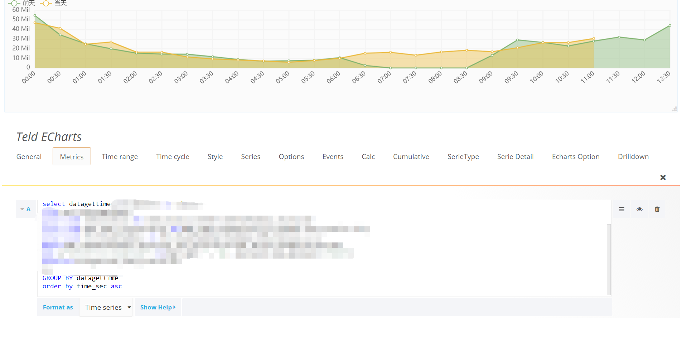
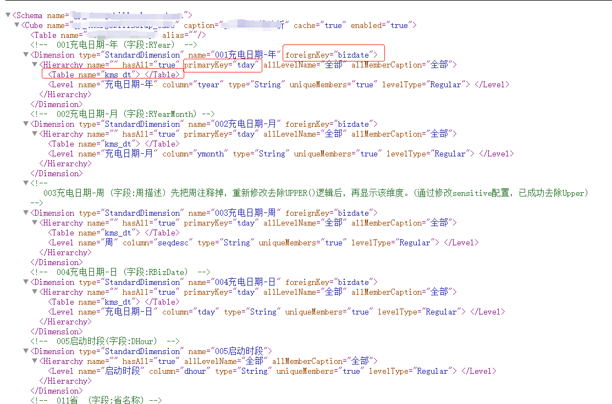
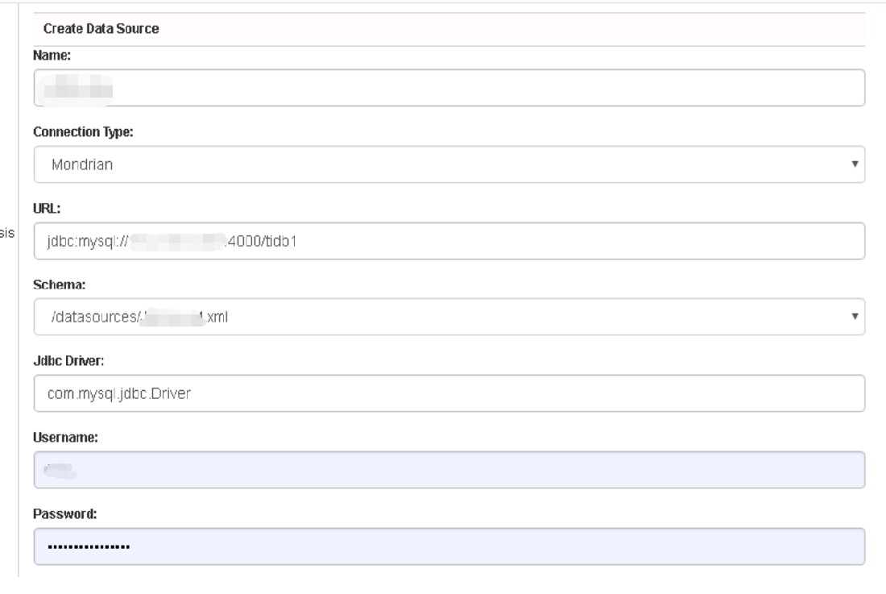
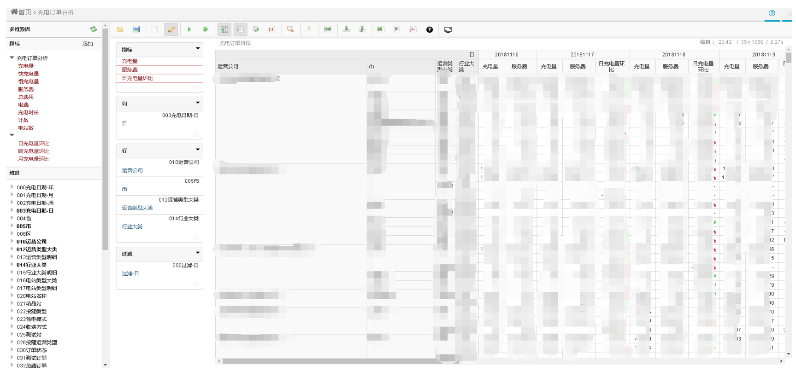

## 6.7 TiDB 与大数据可视化组件的集成应用

TiDB 作为一款 HTAP 数据库，具备海量数据存储的能力，非常适合构建实时数据仓库分析系统。本文主要介绍将 TiDB 作为核心数据存储与大数据可视化领域的 Grafana 和 Saiku 的集成。

### 6.7.1. TiDB 与 Grafana 的集成

Grafana 是一个跨平台的开源的度量分析和可视化工具，可使用内置的 MySQL 的插件连接 TiDB 数据库。

**图 1**

如图 1 所示为 Grafana 面板的设计界面。通过该界面可以通过 SQL 的方式，将数据通过 Grafana  组件进行展示，用于大数据的可视化展现。
      
  注意：
  
    1.基于 Grafana 的展现，最好在创建 TiDB 数据表的时候，包含时间列,这样能够基于时间进行展示分析
    
    2.针对 Grafana 的报表，控制查询范围，另外针对性能要求较高的场景，可以针对性的优化增加索引      
    
### 6.7.2 TiDB 与 Saiku 的集成

 Saiku 提供了一个对用户友好的基于 Web 的分析解决方案，可让用户通过创建和共享报告来快速轻松地分析公司数据。该解决方案可连接到一系列 OLAP 数据库，且部署方案高效简洁。通过 TiDB + Saiku 构架可以搭建成一个 BI 分析平台，使业务分析人员可以进行动态多维分析。同时后期基于 TiDB 的 `TiFlash` 列存储,TiDB在 OLAP 方面的能力得到大幅提升。
       
       多维分析平台的搭建分为两大部分：
       
       第一部分是 Saiku 集群
       
       第二部分 TiDB 集群:TiDB 作为 Saiku 查询的数据源，通过 Saiku 的业务 SQL 直接从 TiDB 中进行数据查询。
       
#### 6.7.2.1. 多维报表的 Schema 定义

按照 Saiku 定义 Schema 的通用规则，可以直接定义跑在 TiDB 上的 Schema 。无需特殊处理。同时可以充分发挥在大数据下的多表关联优势，降低存储和数据维护成本，对关系型数据库常用的星星模型有比较好的支撑。定义的 Schema 实例如下

**图 2**
     
如上图是一个星星模型的 Schema ,维表 kms_dt 通过主键 tday 和主表的 bizdate 进行关联构成星星模型.
            
      注意:   
      在配置 Schema 时,表和字段的大小写要和 TiDB 中的表一致,否则定义的 Schema 在 Saiku 中报错.
   
## 6.7.2.2 TiDB 的数据源定义

通过 Saiku 的管理控制台界面，进行数据源的定义，如图 1-3 所示，相关参数定义如下
   URL:
         TiDB 的拦截地址，如果有负载均衡，可以设置负载均衡的的地址
  Schema:
        多维分析报表对应的 schema
  jdbcdriver：
        由于 TiDB 与 MySQL 良好的集成性，可以直接使用 MySQL 的驱动 jdbc Driver:com.mysql.jdbc.Drive
 账户和密码：
       TiDB 的数据库访问密码

**图 3**

#### 2.3 多维报表的运行

 在 Saiku 界面新建对应多维分析报表分析,在选择多维数据中找到需要定义的数据源,定义上对应的指标和维度作为默认的多维分析界面.分析人员可以根据需求指定自己的私有报表分析。定义完成的报表后通过报表管理界面直接运行，并进行交互式的分析。 运行界面实例如下：
 
   
**图 4**

      注意：
 
      1. 由于 Saiku 默认的星星模型的关联方式是内连接，因此在数据的关联上要注意数据的准确性
 
      2. 由于 Saiku 的查询 SQL 是根据用户自定义的，因此会出现查询 SQL 无法直接使用现有数据库表索引或者语法不够优化等情况。可以通过修改 Saiku 工程的 Mondrian 代码方式，针对 TiDB 数据库进行针对性的修改。同时通过分析 TiDb  的日志表，针对性的对报表增加索引，提升查询速度。

    
   
